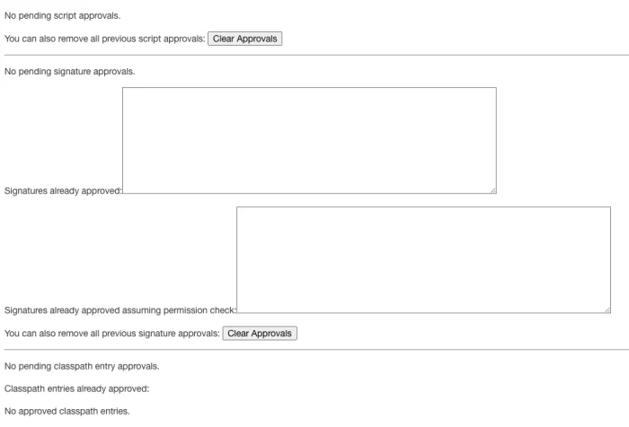

Jenkins Pipeline best practices
There are certain best practices that you should always remember when using Pipeline. This list provides an overview of ten key best practices for Jenkins pipelines to help you use them more efficiently and effectively.

1. Store Pipeline definitions in an SCM
If you've been using Jenkins for any amount of time, you've probably used a Freestyle job, which means that you are used to configuring the job within the Jenkins UI. Although you can define the pipeline definition within a Pipeline job, you really shouldn't. Why? It is a best practice to store the job definition within an SCM, such as Git.

If you store the job definition within the job, you could make a change to the job that has unintended side effects. By storing the job definition in an SCM and enforcing a pull request development flow, you get an audit trail of all of your changes. If you are using a modern Git provider, you can also collaborate with other people on your team using extended comments to discuss the changes prior to the changes being merged for use in production.

Another positive side effect of placing the Jenkinsfile within the same repository as your source code is that the maintainers of the also have the ability to maintain the process that builds, delivers, and deploys the code.

2. When writing a pipeline definition, use Declarative syntax
First, a history lesson. Scripted syntax was released around December of 2014. In February 2017, Declarative syntax was introduced. Until Declarative was released, we had no choice but to use Scripted syntax. However, since that time, many new features, such as matrix, have only been made available for Declarative.

3. Use shared libraries
Do you remember the days when you used inline JavaScript in your web pages? When you introduce a "script" tag into a Declarative pipeline, that's a warning sign that you are starting to head down the same path. When you decide that the "script" tag is the only way to go, instead of using the "script" tag, you should instead create a custom step in a shared library and use that step within your Declarative pipeline.

4.  Don't treat shared libraries as full-fledged projects
Many people will treat shared libraries like a programming project. Here's the thing to keep in mind: Scripted and Declarative syntaxes are meant to only do CI tasks and not to be general-purpose programming languages.

Many Jenkins controller performance issues can be traced back to the misuse of scripted syntax and shared libraries written in a way where all the work is being done within the Jenkins controller itself instead of on the agents.

5. Only use Scripted syntax when it doesn't make sense to use Declarative plus a shared library
Up to this point, we might have scared you away from using Scripted syntax. If so, good. That was the plan. However, there are certain situations where Scripted syntax can be your friend. Here's an example: Imagine that you have a job that has access to numerous machines that could be available as an agent so you can maximize running your job in parallel. However, this job first has to figure out whether or not that machine is currently available as an agent or not. Doing this with Declarative is impossible. However, with Scripted, it is doable.

Here's the simple way to think about writing Jenkins pipeline jobs:

always start with Declarative

when you start doing bad things in Declarative, i.e. script tag, add in a shared library

when Declarative + shared library fails, then go with Scripted

6. Don't use input within an agent
While you can put an input statement within a stage that is within an agent, you definitely shouldn't.

Why? The input element pauses pipeline execution to wait for an approval—either automated or manual. Naturally, these approvals could take some time. An agent, on the other hand, acquires and holds a lock on a workspace and heavy-weight Jenkins executor—an expensive resource to hold onto while pausing for input. So, create your inputs outside of your agents.

pipeline {
    agent none
    stages {
        stage('Example Build') {
            agent {
              label "linux"
            }
            steps {
                sh 'echo Hello World'
            }
        }
        stage('Ready to Deploy') {
            steps {
                input(message: "Deploy to production?")
            }
        }
        stage('Example Deploy') {
            agent {
              label "linux"
            }
            steps {
                sh 'echo Deploying'
            }
        }
    }
}

7. Wrap your input in a timeout
Pipeline has an easy mechanism for timing out any given step of your pipeline. As a best practice, you should always plan for timeouts around your inputs.

Why? To ensure a healthy pipeline cleanup. Wrapping your inputs in a timeout will allow them to be cleaned up (i.e., aborted) if approvals don't occur within a given window.

pipeline {
    agent none
    stages {
        stage('Example Build') {
            agent {
              label "linux"
            }
            steps {
                sh 'echo Hello World'
            }
        }
        stage('Ready to Deploy') {
            options {
                timeout(time: 1, unit: 'MINUTES') 
            }
            steps {
                input(message: "Deploy to production?")
            }
        }
        stage('Example Deploy') {
            agent {
              label "linux"
            }
            steps {
                sh 'echo Deploying'
            }
        }
    }
}
8. Do all work within an agent
Any material work within a pipeline should occur within an agent.

Why? By default, the Jenkinsfile script itself runs on the Jenkins controller, using a lightweight executor expected to use very few resources. Any material work, like cloning code from a Git server or compiling a Java application, should leverage Jenkins distributed builds capability and run on an agent.

For example, the right way to do with within pipeline is:

sh 'bunch of work'

or

bat 'bunch of work'

The wrong way is to create loops and control structures, read directly from exotic things like a SQL database, and write "code" to make business decisions.

9. Acquire agents within parallel steps
Why? One of the main benefits of parallelism in a pipeline is that you can do more material work (see Best Practice #8)! You should generally aim to acquire an agent within the parallel branches of your pipeline.

10. Avoid script security exceptions
In a perfect world, under Manage Jenkins, the "In-process Script Approval" screen should always be empty like the following:

Jenkins Plugin blog script approvals code
If you have entries for script approvals, signature approvals, or classpath entry approvals, that means that you have jobs that are doing bad things from a Jenkins controller stability viewpoint. If you are an administrator of a Jenkins controller and people are asking you to do any kind of approvals, your answer should be an emphatic "No" and then request that the person rewrite what they are trying to do in order to eliminate the need for the approval.

